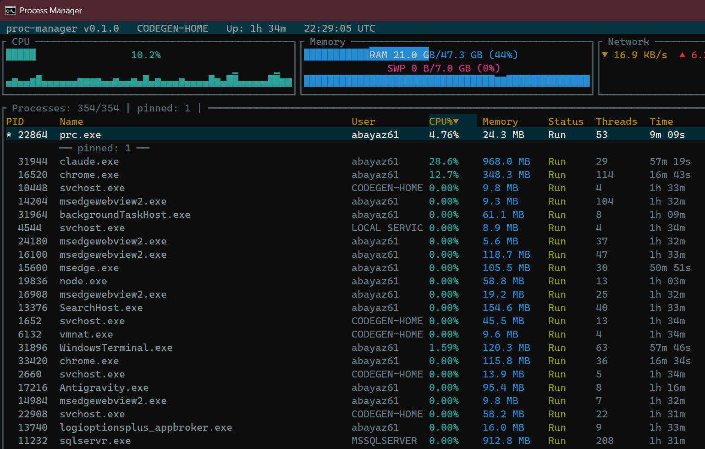
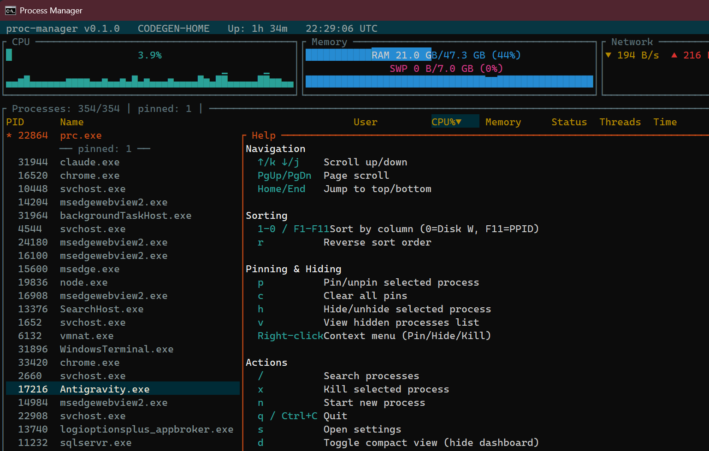
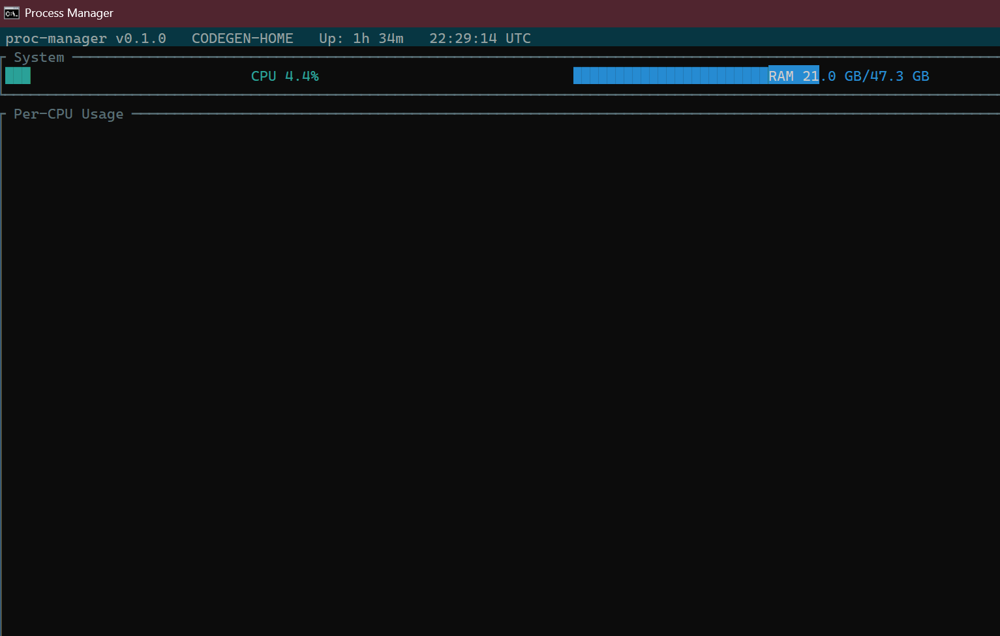
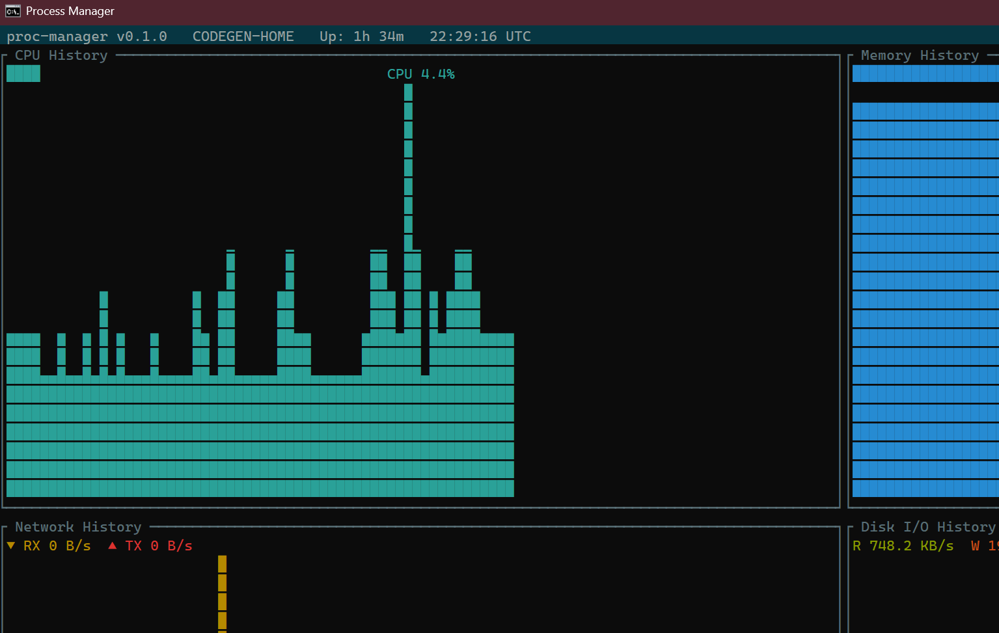
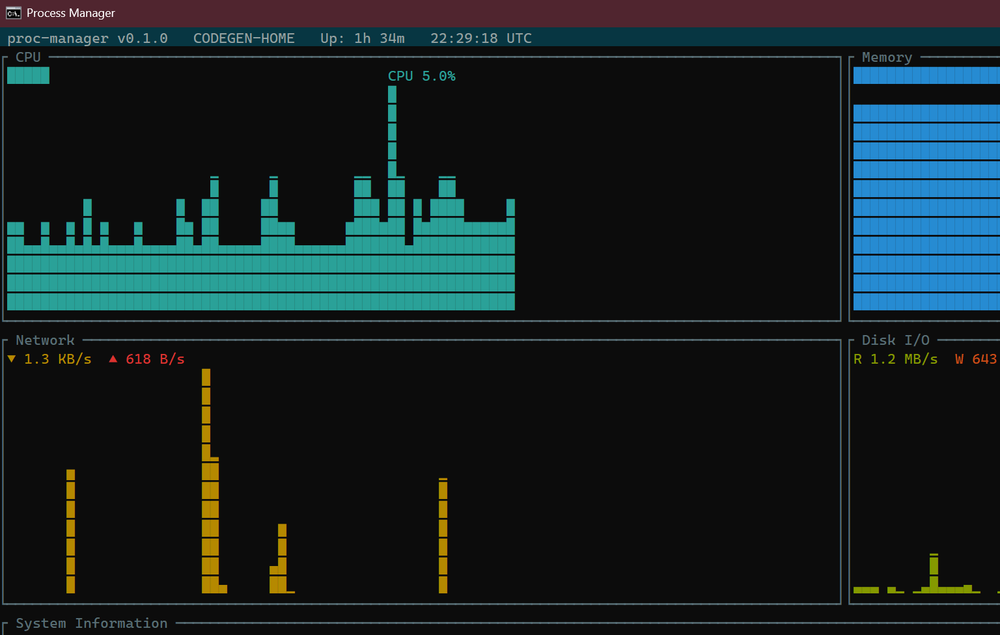
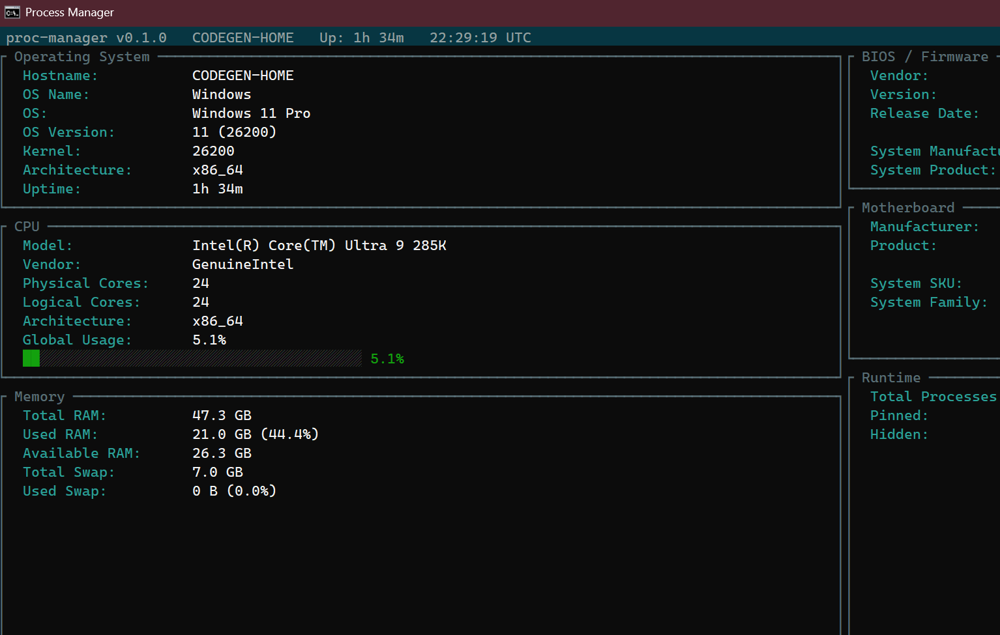
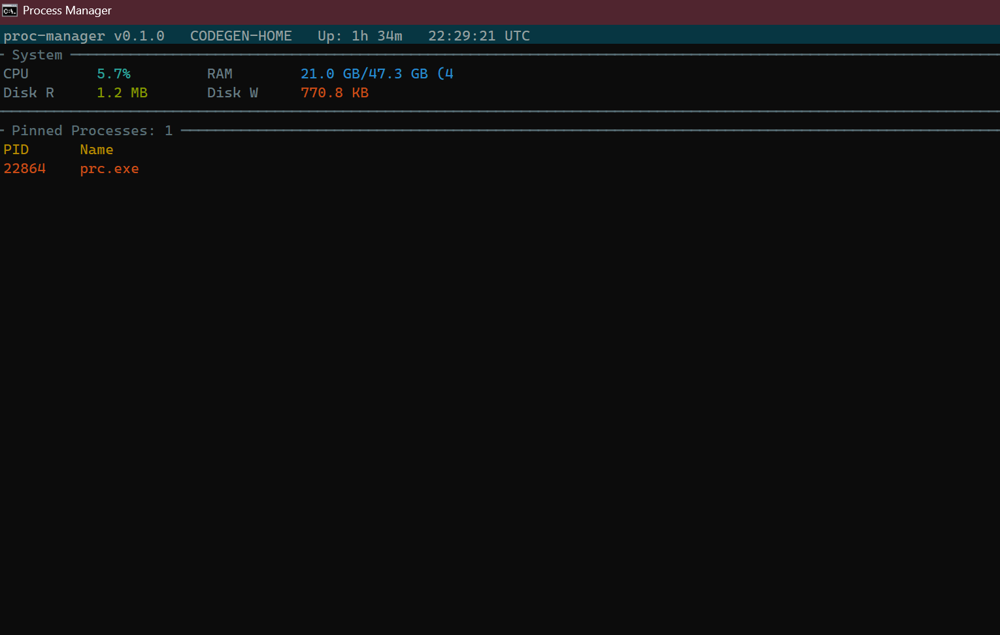
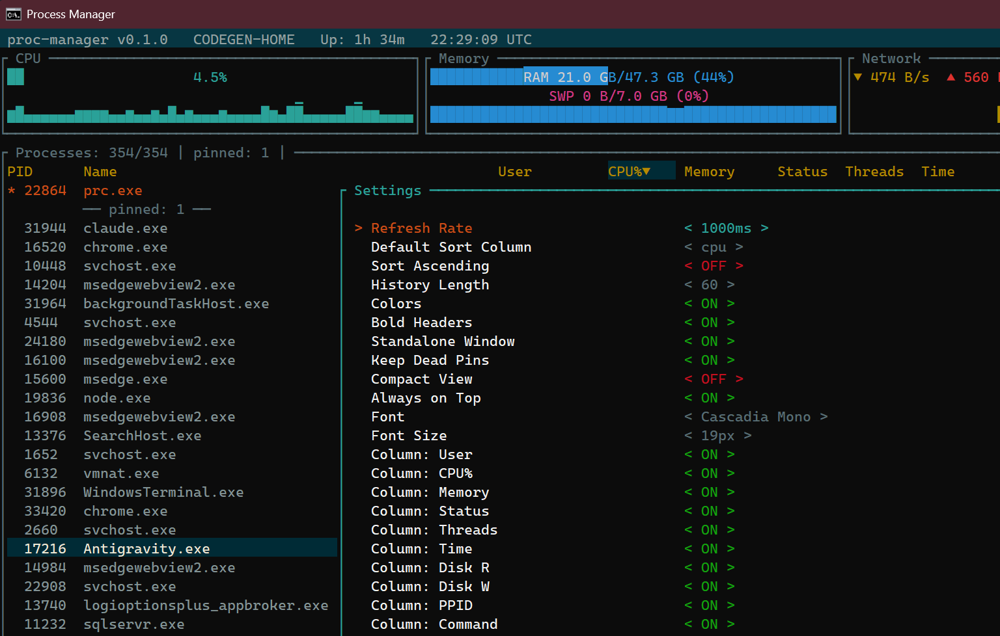
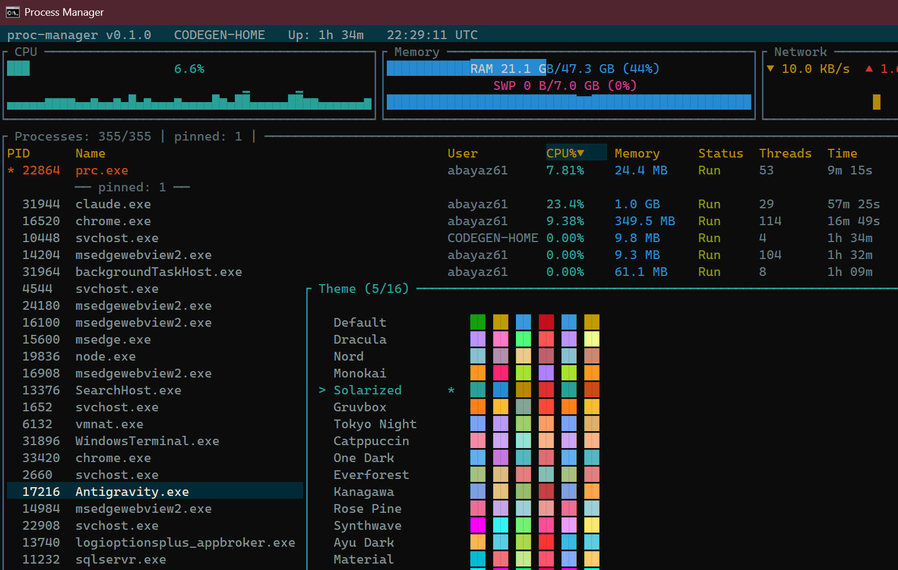

# prc - Process Manager TUI

A high-performance, cross-platform terminal process manager built with Rust. Monitor system resources, manage processes, and keep an eye on pinned tasks — all from a fast, keyboard-driven TUI.



## Features

- **Real-time process monitoring** with configurable refresh rate (200ms - 5s)
- **Dashboard panels** for CPU, Memory, Network, and Disk I/O with sparkline history
- **Process pinning** - pin important processes to the top for quick monitoring
- **Mini Monitor** - a compact view showing only system stats and pinned processes, ideal for developers
- **Always on Top** - keep the window above everything else while you work
- **16 color themes** with live preview
- **Console font & size** settings (Windows)
- **Mouse support** - click to select, right-click for context menu, scroll to navigate
- **Responsive layout** - adapts from 2 to 4 column dashboard based on terminal width
- **Search & PID filter** - find processes instantly
- **6 view modes** - cycle through with Tab
- **Fully configurable** - all settings persist to a TOML config file

## Installation

### Build from source

```bash
# Clone the repository
git clone https://github.com/user/proc-manager.git
cd proc-manager

# Build release binary
cargo build --release

# The binary is at target/release/prc.exe (Windows) or target/release/prc (Linux/macOS)
```

### Add to PATH

You can register `prc` to your system PATH directly from the app:

1. Launch `prc`
2. Press `s` to open Settings
3. Select **Register to PATH**

Or run the binary and it will offer to create a desktop shortcut from the Settings menu.

## Usage

```bash
prc                        # Launch in standalone window
prc --embedded             # Run inside current terminal
prc --tick-rate 500        # Custom refresh rate (ms)
prc --sort memory          # Sort by memory usage
prc --sort cpu --ascending # Sort by CPU ascending
prc --config ./my.toml     # Use custom config file
```

### CLI Options

| Option | Short | Default | Description |
|--------|-------|---------|-------------|
| `--tick-rate` | `-t` | `1000` | Refresh interval in milliseconds |
| `--sort` | `-s` | `cpu` | Default sort column |
| `--ascending` | `-a` | `false` | Sort in ascending order |
| `--config` | `-c` | — | Path to custom config file |

## Keyboard Shortcuts

### Navigation

| Key | Action |
|-----|--------|
| `Up` / `k` | Scroll up |
| `Down` / `j` | Scroll down |
| `PgUp` / `PgDn` | Page scroll |
| `Home` / `End` | Jump to top / bottom |
| `Tab` | Cycle view mode |

### Sorting

| Key | Action |
|-----|--------|
| `1` - `0` / `F1` - `F10` | Sort by column (PID, Name, User, CPU, Memory, Status, Threads, Time, Disk R, Disk W) |
| `F11` | Sort by PPID |
| `r` | Reverse sort order |

### Process Actions

| Key | Action |
|-----|--------|
| `/` | Search processes |
| `f` | PID filter (live filtering) |
| `x` | Kill selected process |
| `n` | Start new process |
| `p` | Pin / unpin process |
| `c` | Clear all pins |
| `h` | Hide / unhide process |
| `v` | View hidden processes |
| `Right-click` | Context menu |

### Application

| Key | Action |
|-----|--------|
| `s` | Open settings |
| `t` | Open theme picker |
| `d` | Toggle compact view |
| `a` | Toggle always on top |
| `?` | Toggle help overlay |
| `q` / `Ctrl+C` | Quit |



## View Modes

Cycle through views with `Tab`:

### Default - Process List

The main view with dashboard panels (CPU, Memory, Network, Disk I/O) and a sortable process table. Pinned processes appear at the top separated by a divider.


### Per-CPU Chart

Visualizes individual CPU core usage with bar charts and gauges for overall CPU and RAM utilization.



### Resource Graphs

Historical sparkline graphs for CPU, Memory, Network, and Disk I/O over time.



### System Overview

A summary of system resource usage.



### System Info

Detailed system hardware and software information.



### Mini Monitor

A compact monitoring view designed for developers. Shows only system stats (CPU, RAM, Disk) and pinned processes with minimal columns (PID, Name, CPU%, Memory). Combine with **Always on Top** (`a`) to create a floating monitor overlay while you work.



## Process Pinning

Pin processes you care about to keep them visible at the top of the list:

- Press `p` to pin/unpin the selected process
- Press `c` to clear all pins
- Right-click a process for context menu options including **Pin by Name** (pins all instances)
- Pinned processes are saved by name and persist across restarts
- When a pinned process exits, a **ghost entry** (gray) is shown for 5 seconds (configurable via "Keep Dead Pins" in settings)

## Settings

Press `s` to open the settings panel. Each setting shows a contextual description at the bottom as you navigate.



| Setting | Type | Range | Description |
|---------|------|-------|-------------|
| Refresh Rate | Slider | 200 - 5000ms | How often process data is refreshed |
| Default Sort Column | Cycle | 11 columns | Column used for default sorting |
| Sort Ascending | Toggle | — | Sort direction |
| History Length | Slider | 10 - 300 | Data points for sparkline charts |
| Colors | Toggle | — | Enable/disable colored output |
| Bold Headers | Toggle | — | Bold text for table headers |
| Standalone Window | Toggle | — | Launch in separate window vs. current terminal |
| Keep Dead Pins | Toggle | — | Keep ghost entries for dead pinned processes |
| Compact View | Toggle | — | Hide dashboard, maximize process table |
| Always on Top | Toggle | — | Keep window above all others |
| Font | Cycle | 5 fonts | Console font face (Consolas, Cascadia Mono, etc.) |
| Font Size | Slider | 8 - 32px | Console font size |
| Column toggles | Toggle | — | Show/hide individual columns |
| Change Theme | Action | — | Open theme picker |
| Register to PATH | Action | — | Add `prc` to system PATH |
| Create Desktop Shortcut | Action | — | Create desktop shortcut |

## Themes

16 built-in color themes with live preview. Press `t` to open the theme picker and navigate with arrow keys — the theme updates in real-time as you browse.



Available themes:
**Default** | **Dracula** | **Nord** | **Monokai** | **Solarized** | **Gruvbox** | **Tokyo Night** | **Catppuccin** | **One Dark** | **Everforest** | **Kanagawa** | **Rose Pine** | **Synthwave** | **Ayu Dark** | **Material** | **Cyberpunk**

## Responsive Layout

The dashboard automatically adapts to your terminal size:

| Terminal Width | Layout |
|---------------|--------|
| < 80 columns | 2 panels (CPU, Memory+Network) |
| 80 - 119 columns | 3 panels (CPU, Memory, Network) |
| >= 120 columns | 4 panels (CPU, Memory, Network, Disk) |

When the terminal height is below 20 rows, dashboard panels are reduced in height. Enable **Compact View** (`d`) to hide the dashboard entirely and maximize the process table.

## Configuration

Settings are stored in a TOML file:

- **Windows:** `%APPDATA%\proc-manager\proc-manager\config.toml`
- **Linux:** `~/.config/proc-manager/proc-manager/config.toml`
- **macOS:** `~/Library/Application Support/com.proc-manager.proc-manager/config.toml`

### Example config

```toml
tick_rate_ms = 1000
sort_column = "cpu"
sort_ascending = false
history_len = 60
standalone_window = true
keep_dead_pins = false
compact_view = false
always_on_top = false
font_name = "Consolas"
font_size = 16
visible_columns = ["pid", "name", "user", "cpu", "memory", "status", "threads", "time"]

[theme]
color_enabled = true
bold_headers = true
theme_name = "Default"
```

### State persistence

Pinned and hidden process names are stored separately:

- **Windows:** `%LOCALAPPDATA%\proc-manager\proc-manager\state.toml`
- **Linux:** `~/.local/share/proc-manager/proc-manager/state.toml`

```toml
pinned = ["node.exe", "cargo.exe"]
hidden = ["svchost.exe"]
```

## Architecture

The application follows the **TEA (The Elm Architecture)** pattern:

```
Event → Input Mapping → Action → Dispatch → State → Render
```

1. **EventHandler** (`src/event.rs`) — Async tokio task polling keyboard, mouse, and tick events
2. **Input Mapping** (`src/input.rs`) — Case-insensitive key normalization and modal key mapping
3. **Dispatch** (`src/app.rs`) — Single state mutation point via `App::dispatch(action)`
4. **Rendering** (`src/ui/`) — Pure functions drawing to a `Frame`, no business logic

### Data flow (each tick)

```
sysinfo refresh → process list update → stable sort
  → resolve pinned PIDs → prune dead pins (5s timeout)
  → push history ring buffers → render
```

### Key modules

| Module | Purpose |
|--------|---------|
| `src/main.rs` | Entry point, standalone window launch via conhost.exe |
| `src/app.rs` | App state, dispatch, settings, view modes |
| `src/config.rs` | TOML configuration, CLI parsing |
| `src/input.rs` | Keybinding mapping per app mode |
| `src/event.rs` | Async event loop (tick + input polling) |
| `src/action.rs` | Action enum (all possible user actions) |
| `src/data/` | Process collection, system data, persistence |
| `src/ui/` | All rendering modules (dashboard, table, overlays, views) |

## Dependencies

| Crate | Version | Purpose |
|-------|---------|---------|
| `ratatui` | 0.29 | Terminal UI framework |
| `crossterm` | 0.28 | Terminal I/O and event handling |
| `sysinfo` | 0.33 | System and process information |
| `tokio` | 1 | Async runtime |
| `clap` | 4 | CLI argument parsing |
| `serde` + `toml` | 1 / 0.8 | Configuration serialization |
| `directories` | 6 | Platform-specific config paths |
| `windows` | 0.57 | Win32 APIs (Windows only) |

## Platform Support

| Feature | Windows | Linux | macOS |
|---------|---------|-------|-------|
| Process monitoring | Yes | Yes | Yes |
| Thread count | Yes (Win32 API) | Yes (sysinfo) | Yes (sysinfo) |
| Standalone window | conhost.exe | xterm/gnome-terminal | Terminal.app |
| Always on Top | Yes (SetWindowPos) | No-op | No-op |
| Font settings | Yes (SetCurrentConsoleFontEx) | No-op | No-op |
| PATH registration | PowerShell (user registry) | Symlink ~/.local/bin | Symlink ~/.local/bin |
| Desktop shortcut | .lnk via WScript.Shell | .desktop file | .desktop file |

## License

MIT
